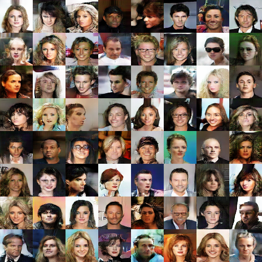
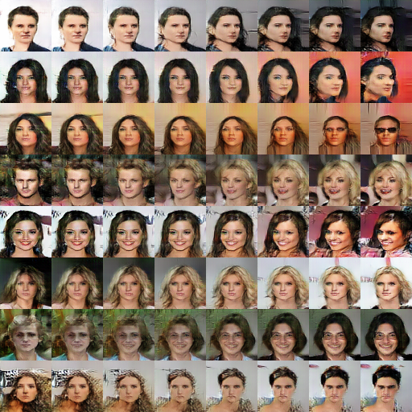

# Deep Convolutional Generative Adversarial Networks (DCGAN)

This repository introduces the TensorFlow 2 implementation of DCGAN described in [UNSUPERVISED REPRESENTATION LEARNING
WITH DEEP CONVOLUTIONAL
GENERATIVE ADVERSARIAL NETWORKS](https://arxiv.org/pdf/1511.06434.pdf) (Radford et al. 2015)

### Requirements
- Python 3.7 or later
- Tensorflow 2.2.0
- numpy
- opencv
- matplotlib

### CelebA Dataset
The model in this repository was trained on CelebA Dataset, which is a large-scale face dataset containing 202.599 celebrity face images. To reproduce the result, the Align&Cropped Images of the CelebA Dataset are required. Please refer to [Large-scale CelebFaces Attributes (CelebA) Dataset](http://mmlab.ie.cuhk.edu.hk/projects/CelebA.html) for more information and downloading.

### Training
To train DCGAN model, use the following command:
```
python run.py --dataset_dir path \ 
              --checkpoint_dir path --progress_dir path \
              --latent_dim int --test_size int \
              --batch_size int --lr float --epochs int
```
where:
- --checkpoint_dir: Path to save checkpoint. Default="./model/checkpoint"
- --progress_dir: Path to write training progress image. Default="./data/face_gan"
- --dataset_dir: Path to dataset.
- --latent_dim: Latent space dimension. Default=100
- --test_size: Number of test images during training is equal test_size^2. Default=4
- --batch_size: Number of training steps per epoch. Default=100
- --lr: Learning rate. Default=0.0002
- --epochs: Number of epochs for training. Default=20

### Training progress
This GIF illustrates the generator improvement during the training


### Results
Samples from latent space | Faces linear transformation
:--------------------------:|:----------------------------: 
 | 